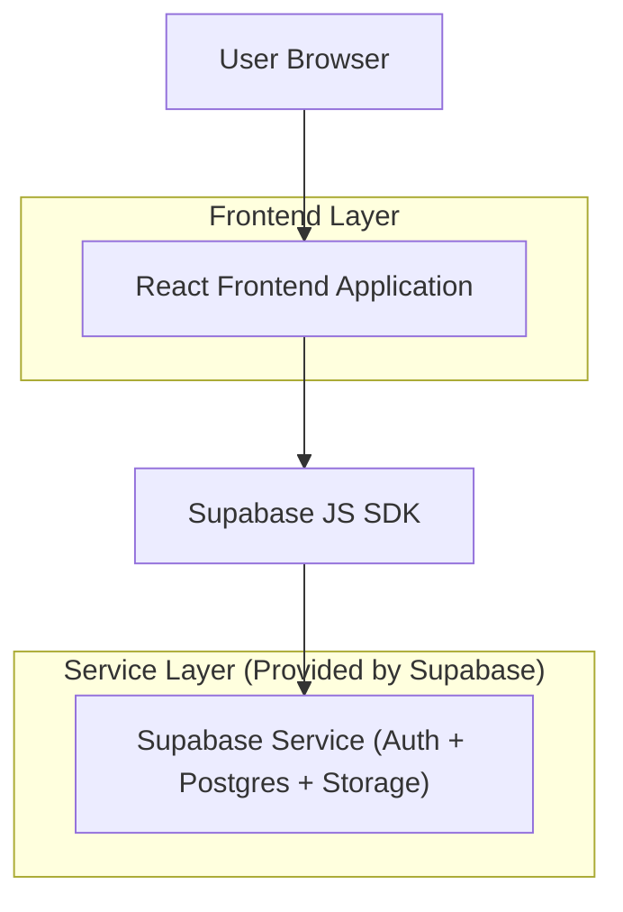
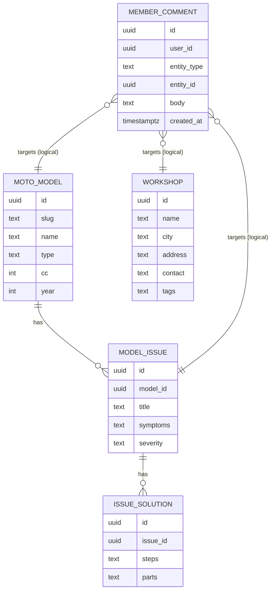

## 1.Architecture design



**Monolito (con responsabilidades claras)**: una única aplicación web (un solo frontend) organizada por módulos de dominio.

* Capa UI: componentes y layouts reutilizables.

* Capa Feature: `modelos/`, `talleres/`, `comentarios/`, `auth/`.

* Capa Data Access: repositorios/servicios por entidad (p.ej. `modelsRepo`, `workshopsRepo`, `commentsRepo`) encapsulando llamadas a Supabase.

* Capa Estado: contexto de autenticación y caché de consultas (p.ej. React Query).

## 2.Technology Description

* Frontend: React\@18 + TypeScript + vite + tailwindcss\@3

* Backend: Supabase (Auth + PostgreSQL + Storage)

## 3.Route definitions

| Route          | Purpose                                          |
| -------------- | ------------------------------------------------ |
| /              | Inicio: navegación, buscador y resúmenes         |
| /modelos       | Catálogo de modelos: listado + filtros           |
| /modelos/:slug | Ficha de modelo: fallas/soluciones + comentarios |
| /talleres      | Talleres recomendados: listado + filtros         |
| /talleres/:id  | Ficha de taller: datos + comentarios             |
| /login         | Acceso: iniciar sesión                           |
| /registro      | Acceso: crear cuenta                             |

## 6.Data model(if applicable)

### 6.1 Data model definition



### 6.2 Data Definition Language

**Tablas principales (sin FKs físicos; relaciones lógicas por campos id):**

```sql
-- modelos
CREATE TABLE moto_models (
  id UUID PRIMARY KEY DEFAULT gen_random_uuid(),
  slug TEXT UNIQUE NOT NULL,
  name TEXT NOT NULL,
  type TEXT,
  cc INT,
  year INT,
  created_at TIMESTAMPTZ DEFAULT now()
);

-- fallas
CREATE TABLE model_issues (
  id UUID PRIMARY KEY DEFAULT gen_random_uuid(),
  model_id UUID NOT NULL,
  title TEXT NOT NULL,
  symptoms TEXT,
  severity TEXT,
  created_at TIMESTAMPTZ DEFAULT now()
);

-- soluciones
CREATE TABLE issue_solutions (
  id UUID PRIMARY KEY DEFAULT gen_random_uuid(),
  issue_id UUID NOT NULL,
  steps TEXT NOT NULL,
  parts TEXT,
  created_at TIMESTAMPTZ DEFAULT now()
);

-- talleres
CREATE TABLE workshops (
  id UUID PRIMARY KEY DEFAULT gen_random_uuid(),
  name TEXT NOT NULL,
  city TEXT,
  address TEXT,
  contact TEXT,
  tags TEXT,
  created_at TIMESTAMPTZ DEFAULT now()
);

-- comentarios (sobre modelo/falla/taller)
CREATE TABLE member_comments (
  id UUID PRIMARY KEY DEFAULT gen_random_uuid(),
  user_id UUID NOT NULL,
  entity_type TEXT NOT NULL CHECK (entity_type IN ('model','issue','workshop')),
  entity_id UUID NOT NULL,
  body TEXT NOT NULL,
  created_at TIMESTAMPTZ DEFAULT now(),
  updated_at TIMESTAMPTZ DEFAULT now()
);
```

**Permisos (base) + RLS (recomendado):**

```sql
-- grants mínimos (ajusta según tu esquema y necesidades)
GRANT SELECT ON moto_models, model_issues, issue_solutions, workshops, member_comments TO anon;
GRANT ALL PRIVILEGES ON moto_models, model_issues, issue_solutions, workshops, member_comments TO authenticated;

-- habilitar RLS
ALTER TABLE member_comments ENABLE ROW LEVEL SECURITY;

-- lectura pública de comentarios
CREATE POLICY "comments_select_public" ON member_comments
FOR SELECT USING (true);

-- crear comentario: solo autenticado y dueño
CREATE POLICY "comments_insert_own" ON member_comments
FOR INSERT TO authenticated
WITH CHECK (auth.uid() = user_id);

-- editar/borrar: solo dueño
CREATE POLICY "comments_update_own" ON member_comments
FOR UPDATE TO authenticated
USING (auth.uid() = user_id)
WITH CHECK (auth.uid() = user_id);

CREATE POLICY "comments_delete_own" ON member_comments
FOR DELETE TO authenticated
USING (auth.uid() = user_id);
```

