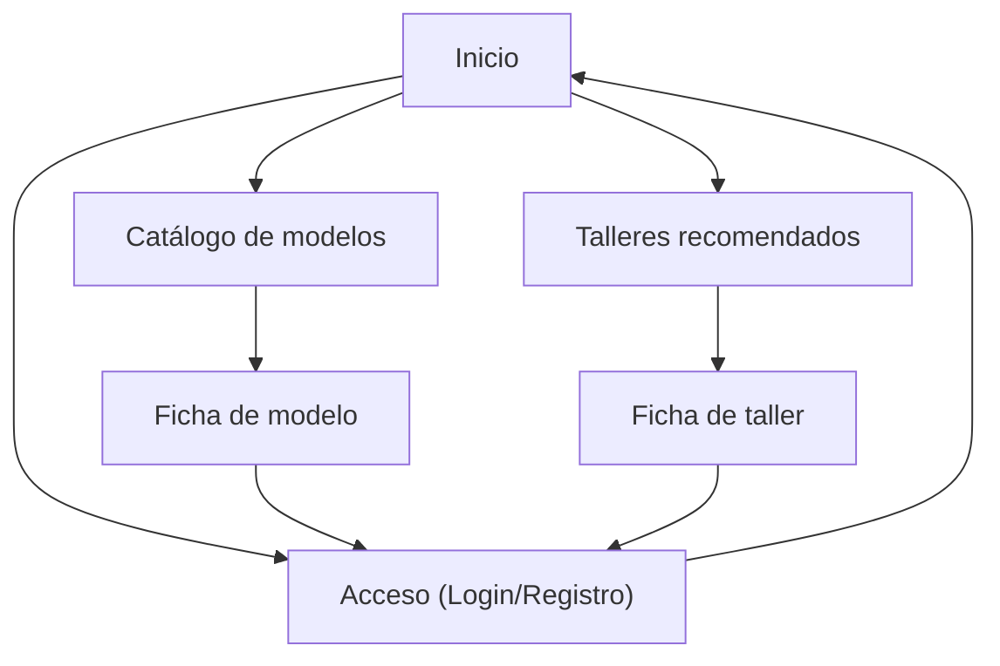

## 1. Product Overview
Web comunitaria del grupo motociclista Voge para consultar modelos, fallas frecuentes y sus soluciones, además de talleres recomendados.
Incluye comentarios de miembros con autenticación mediante Supabase para mantener trazabilidad y participación.

## 2. Core Features

### 2.1 User Roles
| Role | Registration Method | Core Permissions |
|------|---------------------|------------------|
| Visitante | Sin registro | Ver catálogo de modelos, fallas/soluciones, talleres y comentarios públicos |
| Miembro | Registro/Login con Supabase Auth (email) | Publicar/editar/eliminar sus comentarios; ver contenido completo |

### 2.2 Feature Module
La web se compone de estas páginas principales:
1. **Inicio**: navegación principal, buscador, accesos directos a catálogo y talleres, bloques de “últimas fallas” y “últimos comentarios”.
2. **Catálogo de modelos**: listado con filtros; ficha de modelo con fallas/soluciones y comentarios.
3. **Talleres recomendados**: listado con filtros; ficha del taller con datos, notas y comentarios.
4. **Acceso (Login/Registro)**: autenticación Supabase y recuperación básica.

### 2.3 Page Details
| Page Name | Module Name | Feature description |
|-----------|-------------|---------------------|
| Inicio | Header + navegación | Mostrar menú a Catálogo, Talleres y Acceso; indicar estado de sesión (visitante/miembro). |
| Inicio | Buscador | Buscar por nombre de modelo y por palabra clave en fallas/soluciones. |
| Inicio | Resúmenes | Mostrar listas cortas de “Fallas recientes” y “Comentarios recientes” con enlaces a detalle. |
| Catálogo de modelos | Listado + filtros | Listar modelos Voge con filtrado básico (tipo/cilindrada/año si existe). |
| Catálogo de modelos | Ficha de modelo | Mostrar descripción del modelo y secciones de fallas frecuentes con sus soluciones asociadas. |
| Catálogo de modelos | Comentarios | Listar comentarios; permitir a miembros crear/editar/eliminar sus propios comentarios. |
| Talleres recomendados | Listado + filtros | Mostrar talleres recomendados con ciudad/zona y etiquetas (p.ej. “oficial”, “multimarca”, “electricidad”). |
| Talleres recomendados | Ficha de taller | Mostrar datos (dirección, contacto, horario, notas) y recomendaciones del grupo. |
| Talleres recomendados | Comentarios | Listar comentarios; permitir a miembros crear/editar/eliminar sus propios comentarios. |
| Acceso (Login/Registro) | Login/Registro | Autenticar con Supabase (email + password); registrar cuenta nueva. |
| Acceso (Login/Registro) | Recuperación | Permitir envío de enlace de recuperación de contraseña. |

## 3. Core Process
**Flujo de Visitante**: entras en Inicio, navegas al Catálogo o Talleres, consultas fichas y lees comentarios públicos.

**Flujo de Miembro**: desde Acceso inicias sesión/te registras, vuelves al Catálogo o Talleres, y publicas comentarios; puedes editar o borrar los tuyos.

